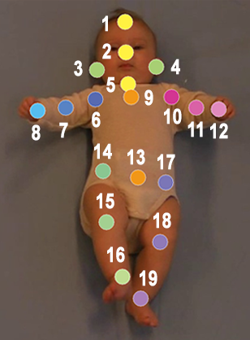

# Keypoint annotation Program

*Tool for annotating keypoints in images*


## How to use the annotation program?

1. Run program

In terminal, specify the following command with images to annotate placed in ```images```:
```
python .\annotate.py --image-folder images
```

2. Training
	
In order to guide the user of how the annotation task should be ideally performed, there are some training examples to begin with. The training examples is completed before the real annotation work can begin. For each training example the following steps must be performed:
	

* 1. Click on the next body part according to the help text and the guideline in the bottom left corner.
	
* 2. A marker with a grey color indicates that the marker is not correctly placed. Drag the marker to adjust its location.
	
* 3. When the correct location is assigned to a marker, the marker is displayed in the color corresponding with the guideline. Accordingly, the next body part can be placed by repeating the procedure.
	
* 4. When all body part markers have been correctly placed, **CONFIRM ANNOTATION** should be pressed and the next training example will pop up
	
* 5. After completing all training examples the user is displayed a message and should press the button **START TO ANNOTATE** to start annotating.

	
    
3. Annotate images

After completing training, the user starts annotation images:
	

* 1. Similarily to during training, the body parts are clicked in a specific sequence indicated by the help text and the guideline of the bottom left corner of the annotation GUI. 
	
* 2. At any time body parts can be clicked and dragged to adjust the placement of markers. 
	
* 3. When all markers have been placed and the user is satisfied with the placement of markers the annotation is saved by pressing **CONFIRM ANNOTATION**. The next image is then displayed to the user and the process of annotating an image is repeated.
	
* 4. If the user at any time wants to change a previously annotated image the button **LAST IMAGE** can be pressed and adjustments made accordingly. The updated locations of markers will replace the ones that already exist. 
	
	

A more thorough description of the functionality of the annotation GUI as well as of how to annotate correctly is given below. 


4. Close program

	

The program can be closed at any time by pressing the *ESCAPE* key and restored by running the program as described above.


## Definition of body parts



### General comment

All body parts should be annotated in all images. If a body part overlaps another or the body part is not visible in the image, the marker should be placed where the user believes the body part to reside in the 2D-plane. Although this can result in markers being placed on top of each other, this is consistent with the guidelines of annotation.

The final coordinates is recorded from the center of the body part markers. Hence it is important to be precise when placing the markers.

### 1. Head top 

* Top of the forehead

### 2. Nose 

* Tip of the nose

### 3. Right ear 

* Center of the right ear 

### 4. Left ear 

* Center of the left ear 

### 5. Upper neck 

* Center of the larynx

### 6. Right shoulder 

* Center of the right shoulder joint 

### 7. Right elbow 

* Center of the right elbow joint 

### 8. Right wrist 

* Center of the right wrist joint 

### 9. Upper chest 

* Midway between the center of the left and right shoulder 

### 10. Left shoulder 

* Center of the left shoulder joint 

### 11. Left elbow 

* Center of the left elbow joint

### 12. Left wrist 

* Center of the left wrist joint 

### 13. Mid pelvis

* Midway between the left and right pelvis (see definition of left and right pelvis below)

### 14. Right pelvis 

* Right spina iliaca anterior superior 

### 15. Right knee

* Center of the right knee joint

### 16. Right ankle 

* Center of the right ankle joint 

### 17. Left pelvis

* Left spina iliaca anterior superior 

### 18. Left knee

* Center of the left knee joint

### 19. Left ankle

* Center of the left ankle joint


## Program functionality

### GUI


* **GUIDELINE**: displays the order of how the body parts should be clicked and which colors that belong to which body parts

### Functions

#### Button actions

* **LAST IMAGE**: button to move to the last image that was annotated

* **CONFIRM ANNOTATION**: button to confirm annotation and move to the next image

#### Mouse actions 

* *CLICK* on image: Place marker on the next body part to annotate

* *DRAG* existing marker: Adjust location of existing marker

* *RIGHT CLICK* on image: Same as **CONFIRM ANNOTATION**

#### Keyboard actions

* *RIGHT ARROW*: Same as **CONFIRM ANNOTATION**

* *ENTER*: Same as **CONFIRM ANNOTATION**

* *SPACE BAR*: Same as **CONFIRM ANNOTATION**

* *LEFT ARROW*: Same as  **LAST IMAGE**

* *BACKSPACE*: Same as **LAST IMAGE**

* *ESCAPE*: Close the program